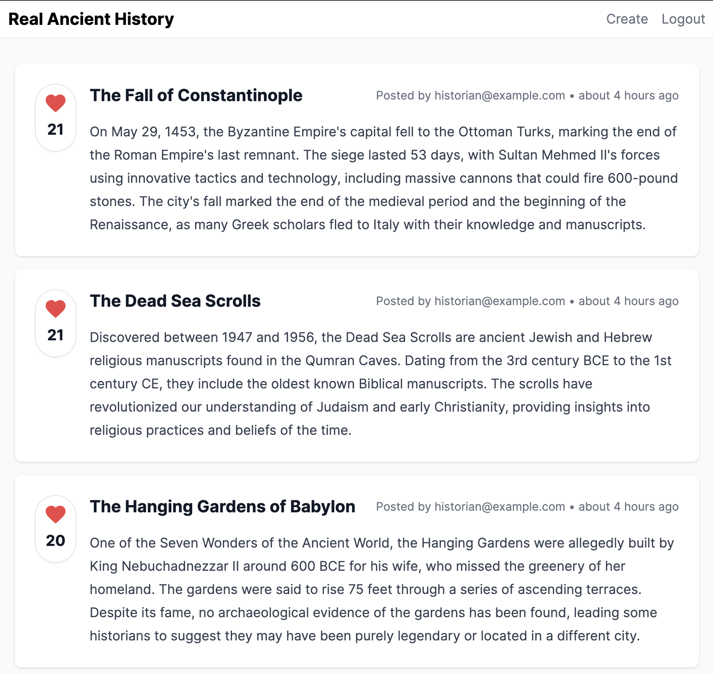

# Ancient History

## Description

### Rails 8

This is a Rails application that allows users to read and write about ancient history.

1. Posts System:
   - Users can create posts with titles and content
   - Posts are ranked using a sophisticated algorithm that considers:
     - Number of votes
     - Time decay (24-hour exponential decay)
   - Posts appear on the homepage ordered by their ranking score

2. Voting System:
   - Users can upvote posts
   - Votes are tracked per user (one vote per post)
   - Has an animated heart icon when voting
   - Shows vote count in a circular container

3. Comments System:
   - Nested under posts
   - Real-time updates using Hotwire/Turbo
   - Shows user avatar (first letter of email)
   - Displays comment timestamp
   - Comments are ordered newest first
   - Shows comment count

4. User System:
   - Has authentication (sign in/sign out)
   - Uses email addresses for identification
   - Password reset functionality
   - User sessions management

5. UI/UX Features:
   - Modern design using Tailwind CSS
   - Responsive layout
   - Real-time updates with Turbo
   - Flash messages for notifications
   - Clean navigation with back buttons
   - Form validations

6. Technical Features:
   - Uses Hotwire (Turbo) for real-time updates
   - Stimulus controllers for JavaScript functionality
   - SQLite database
   - Proper model relationships and validations
   - Efficient database queries with eager loading

7. Routes:
   - Root route shows the ranked posts
   - Individual post pages
   - Voting endpoints
   - Comment creation endpoints
   - Session management routes
   - Password reset routes
   - Has a "map" feature (though implementation not shown)

Would you like me to dive deeper into any particular aspect of the application?
